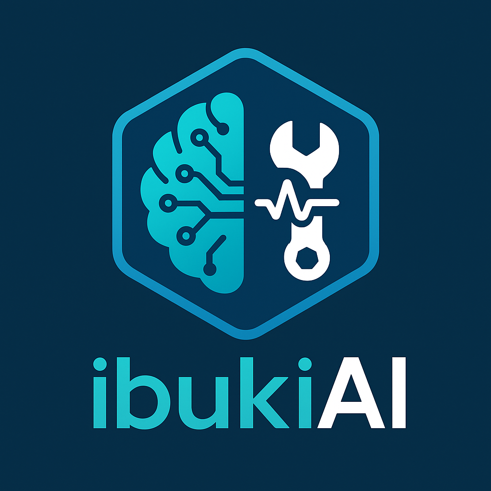
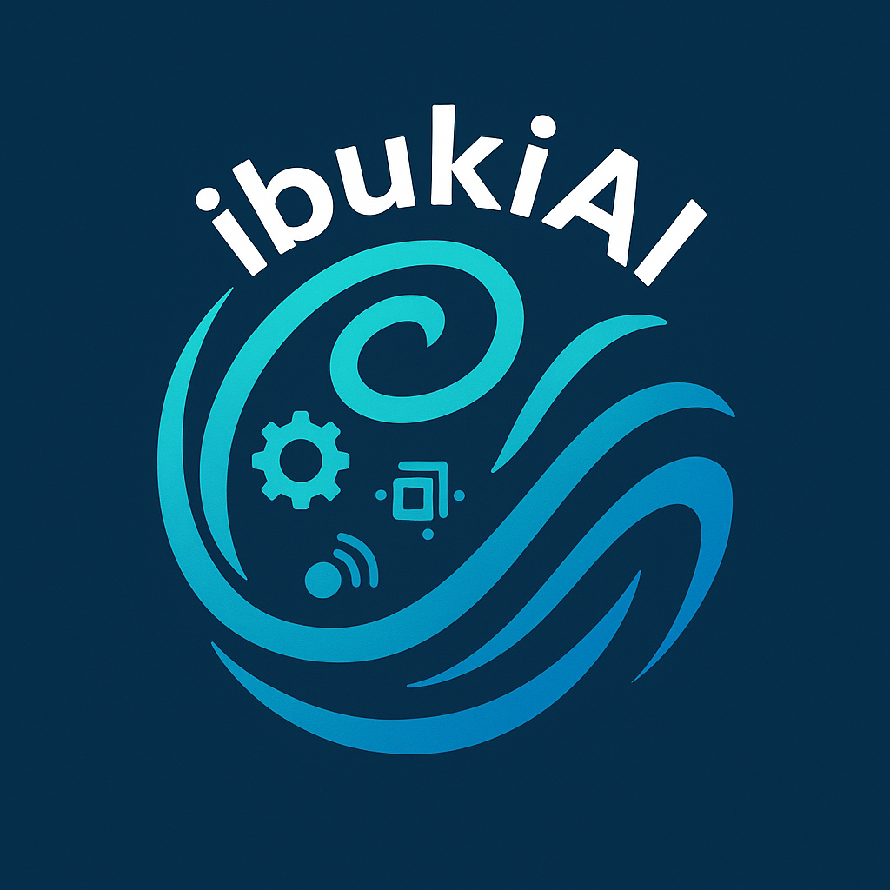

# ibuki AI とは
‐ Industrial Breakdown Understanding & Kinetics Insight AI
　→ 故障予兆と動作解析を行う産業用AI
‐ IBUKI: Industrial Breathe of Useful Kinetic Intelligence + AI
　→ 「産業機械に新たな“息吹”を与えるAI知能」
　（語感と意味をかけたネーミング）

# アイコン案
## A案
【未来的保全】
デザイン案：

左半分に配線チップ風の脳（AI）

右半分にスパナ＋波動マーク（保全・振動）

背景は六角形（工業・テクノロジーの象徴）

## B案
【ibuki（息吹）＋テクノロジー】
デザイン案：

風や息吹を表す曲線（渦巻き風）

その曲線の中に小さなギアやセンサーアイコン

上部に「ibukiAI」の文字を曲線に沿わせる

